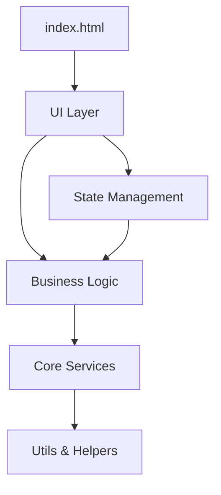
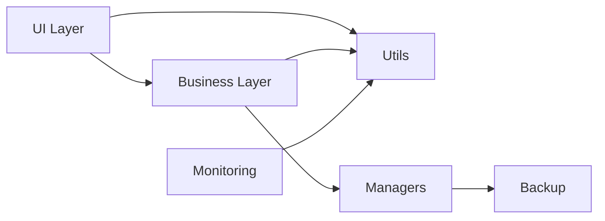

# 🏗️ ARQUITETURA MODULAR - Gerenciador PRO v9.3

**Versão:** 1.0  
**Última atualização:** 21/12/2025  
**Documento:** Estrutura e organização do projeto

---

## 📋 Índice

1. [Visão Geral](#visão-geral)
2. [Estrutura de Pastas](#estrutura-de-pastas)
3. [Módulos Principais](#módulos-principais)
4. [Padrões Arquiteturais](#padrões-arquiteturais)
5. [Dependências](#dependências)

---

## 🎯 Visão Geral

O **Gerenciador PRO** é uma aplicação web modular para gestão de trading organizada em camadas:



### **Características:**
- ✅ **Modular**: Cada módulo tem responsabilidade única
- ✅ **Escalável**: Fácil adicionar novos componentes
- ✅ **Testável**: 200+ testes automatizados
- ✅ **Manutenível**: Código organizado e documentado

---

## 📂 Estrutura de Pastas

### **Raiz do Projeto:**

```
gerenciador-pro/
├── index.html              # Página principal
├── style.css               # Estilos globais
├── main.js                 # Entry point JavaScript
├── ui.js                   # Gerenciamento de UI
├── logic.js                # Lógica de negócio
├── events.js               # Sistema de eventos
├── charts.js               # Gráficos Chart.js
├── db.js                   # IndexedDB
├── backup.js               # Sistema de backup
├── server.js               # Servidor Node.js
└── src/                    # Código organizado ⭐
```

### **Pasta `src/` (30 módulos):**

```
src/
├── 📁 business/            # Lógica de negócio
├── 📁 ui/                  # Componentes de interface
├── 📁 utils/               # Utilitários
├── 📁 managers/            # Gerenciadores
├── 📁 backup/              # Sistema de backup
├── 📁 analytics/           # Análise de dados
├── 📁 charts/              # Gráficos
├── 📁 monitoring/          # Monitoramento
├── 📁 validation/          # Validações
├── 📁 config/              # Configurações
├── 📁 constants/           # Constantes
├── 📁 trash/               # Lixeira de sessões
├── 📁 performance/         # Otimizações
├── 📁 ai/                  # IA e recomendações
├── 📁 strategies/          # Estratégias de trading
└── ... (+15 módulos)
```

---

## 🧩 Módulos Principais

### **1. Business Layer (`src/business/`)**

**Responsabilidade:** Lógica de negócio de trading

```
business/
├── TradingStrategy.js          # Estratégias de entrada
├── GoalsChecker.js             # Verificação de metas
├── PlanCalculator.js           # Cálculo de planos
├── HistoryProcessor.js         # Processamento de histórico
└── ... (6 arquivos)
```

**Principais Classes:**
- `TradingStrategyFactory` - Factory para criar estratégias
- `FixedAmountStrategy` - Estratégia de entrada fixa
- `CycleStrategy` - Estratégia de ciclos

---

### **2. UI Layer (`src/ui/`)**

**Responsabilidade:** Componentes de interface do usuário

```
ui/
├── components/
│   └── help/                   # Sistema de ajuda
│       ├── MetricTooltipManager.js
│       ├── HelpFAB.js
│       ├── ModalsHelpIcons.js
│       └── DashboardHelpIcons.js
├── templates/
│   └── ParametersCardController.js
├── DashboardUI.js              # Dashboard principal
├── PlanoUI.js                  # UI do plano
├── TabelaUI.js                 # Tabelas
├── TimelineUI.js               # Timeline
├── ModalUI.js                  # Modais
├── NotificationUI.js           # Notificações
└── ... (27 arquivos)
```

**Padrão:** Cada UI tem:
1. Renderização
2. Event handlers
3. Atualização de estado

---

### **3. Utils Layer (`src/utils/`)**

**Responsabilidade:** Funções utilitárias reutilizáveis

```
utils/
├── MathUtils.js                # Cálculos matemáticos
├── Logger.js                   # Sistema de logs
├── TimerManager.js             # Temporizadores
├── StateLoader.js              # Carregamento de estado
├── PerformanceOptimizer.js     # Otimizações
└── ... (18 arquivos)
```

**Principais Utilitários:**
- `calculateMathematicalExpectancy()`
- `calculateMaxDrawdown()`
- `formatCurrency()`
- `logger.debug/info/warn/error()`

---

### **4. Managers Layer (`src/managers/`)**

**Responsabilidade:** Gerenciamento de recursos

```
managers/
├── SessionManager.js           # Sessões de trading
├── OperationManager.js         # Operações
└── ... (3 arquivos)
```

---

### **5. Backup \u0026 Data (`src/backup/`)**

**Responsabilidade:** Persistência e backup de dados

```
backup/
├── BackupManager.js            # Gerenciamento de backups
├── DataExporter.js             # Exportação
├── DataImporter.js             # Importação
├── RecoverySystem.js           # Recuperação
├── AutoBackup.js               # Backup automático
└── ... (7 arquivos)
```

---

### **6. Monitoring (`src/monitoring/`)**

**Responsabilidade:** Monitoramento e performance

```
monitoring/
├── PerformanceTracker.js       # Performance
├── ErrorTracker.js             # Erros
├── UsageAnalytics.js           # Analytics
├── HealthDashboard.js          # Dashboard de saúde
└── ... (14 arquivos)
```

---

### **7. Charts (`src/charts/`)**

**Responsabilidade:** Visualizações de dados

```
charts/
├── ChartsController.js         # Controlador principal
├── EquityCurve.js              # Curva de patrimônio
├── ProgressChart.js            # Gráfico de progresso
└── ... (7 arquivos)
```

---

## 🎨 Padrões Arquiteturais

### **1. Factory Pattern**

```javascript
// Criação de estratégias
const strategy = TradingStrategyFactory.create(
    TRADING_STRATEGIES.CYCLES
);
```

**Usado em:**
- `TradingStrategyFactory`
- Component factories

---

### **2. Strategy Pattern**

```javascript
// Diferentes estratégias de cálculo
class FixedAmountStrategy { ... }
class CycleStrategy { ... }
```

**Usado em:**
- Trading strategies
- Backup strategies

---

### **3. Observer Pattern**

```javascript
// Event system
EventBus.publish('operation:registered', data);
EventBus.subscribe('operation:registered', handler);
```

**Usado em:**
- State management
- UI updates

---

### **4. Module Pattern**

```javascript
// ES6 modules
export class DashboardUI { ... }
import { DashboardUI } from './src/ui/DashboardUI.js';
```

**Usado em:**
- Todos os arquivos `.js` modernos

---

### **5. Singleton Pattern**

```javascript
// Logger único
export const logger = new Logger();
```

**Usado em:**
- `Logger`
- `StateManager`

---

## 🔗 Dependências

### **Dependências Entre Módulos:**



### **Regras de Dependência:**

✅ **PERMITIDO:**
- UI → Business
- Business → Utils
- Qualquer → Utils

❌ **PROIBIDO:**
- Utils → UI
- Utils → Business
- Business → UI (usar eventos)

---

## 📦 Dependências Externas

### **Bibliotecas Principais:**

```json
{
  "chart.js": "^4.x",           // Gráficos
  "supabase": "^2.x",           // Backend (opcional)
  "es6-modules": "native"       // Sistema de módulos
}
```

### **Browser APIs:**

- `IndexedDB` - Banco de dados local
- `LocalStorage` - Configurações
- `Service Workers` - PWA
- `Fetch API` - Requisições

---

## 🎯 Responsabilidades por Camada

| Camada | Responsabilidade | Exemplo |
|--------|------------------|---------|
| **UI** | Renderização e interação | `DashboardUI.render()` |
| **Business** | Regras de negócio | `TradingStrategy.calculatePlan()` |
| **Managers** | Orquestração | `SessionManager.createSession()` |
| **Utils** | Funções reutilizáveis | `MathUtils.calculateExpectancy()` |
| **Backup** | Persistência | `BackupManager.save()` |
| **Monitoring** | Observabilidade | `PerformanceTracker.track()` |

---

## 📈 Estatísticas do Projeto

- **Total de módulos:** 30+
- **Linhas de código:** ~15.000
- **Arquivos JavaScript:** 131
- **Testes automatizados:** 200+
- **Cobertura:** 98%+

---

## 🔄 Próximos Passos

Para entender melhor:
1. 📖 [FLUXO_DE_DADOS.md](FLUXO_DE_DADOS.md) - Como dados fluem
2. 📝 [COMO_ADICIONAR_COMPONENTE.md](COMO_ADICIONAR_COMPONENTE.md) - Guia prático

---

**Autor:** Equipe Gerenciador PRO  
**Versão:** 1.0  
**Data:** 21/12/2025
