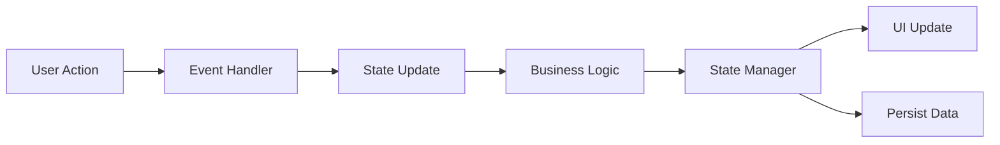
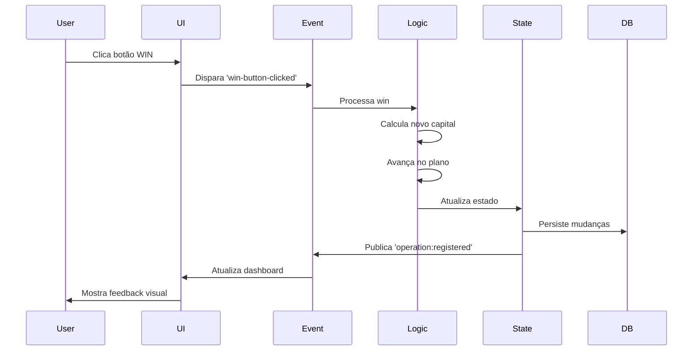
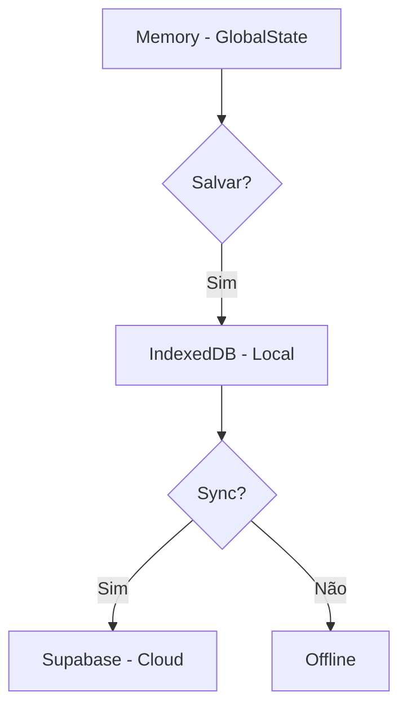
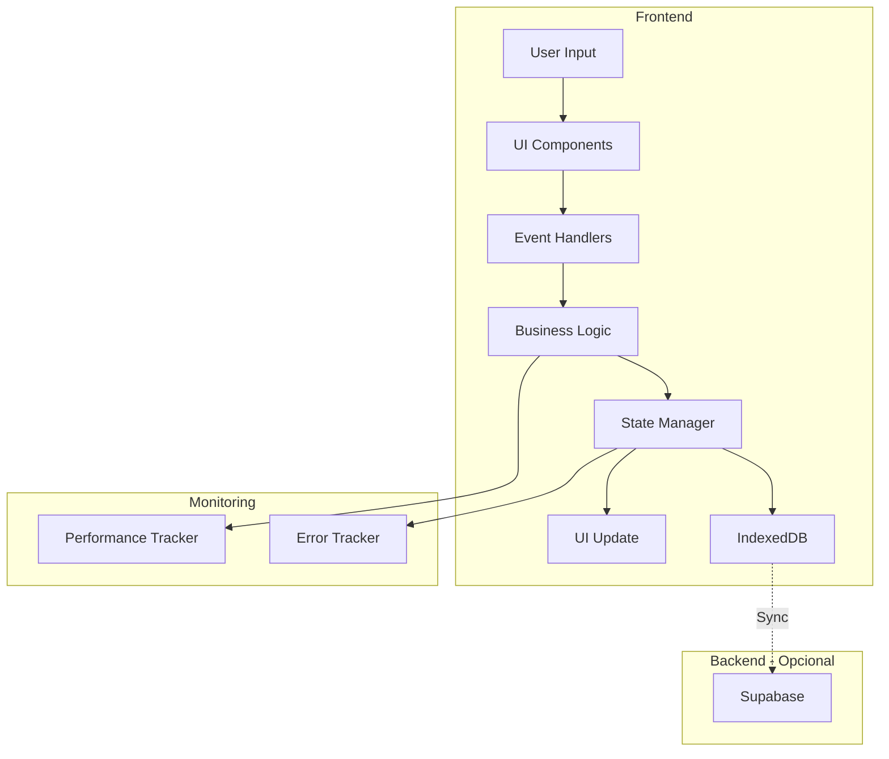

# 🔄 FLUXO DE DADOS - Gerenciador PRO v9.3

**Versão:** 1.0  
**Última atualização:** 21/12/2025  
**Documento:** Como os dados fluem pela aplicação

---

## 📋 Índice

1. [Visão Geral](#visão-geral)
2. [Ciclo de Vida de uma Operação](#ciclo-de-vida-de-uma-operação)
3. [State Management](#state-management)
4. [Sistema de Eventos](#sistema-de-eventos)
5. [Persistência de Dados](#persistência-de-dados)

---

## 🎯 Visão Geral

O fluxo de dados no Gerenciador PRO segue um padrão **unidirecional** com sincronização bidirecional:



### **Princípios:**
- ✅ **Single Source of Truth**: Estado centralizado
- ✅ **Unidirectional Flow**: Dados fluem em uma direção
- ✅ **Event-Driven**: Comunicação via eventos
- ✅ **Immutable Updates**: Estado nunca é mutado diretamente

---

## 🎮 Ciclo de Vida de uma Operação

### **Exemplo: Registrar um WIN**



### **Código Detalhado:**

#### **1. User Action** (UI)

```javascript
// events.js - Event Handler
document.getElementById('win-btn').addEventListener('click', () => {
    // Validações
    if (!sessionActive) return;
    
    // Dispara evento
    EventBus.publish('win-button-clicked', {
        step: currentStep,
        timestamp: Date.now()
    });
});
```

#### **2. Business Logic** (Logic Layer)

```javascript
// logic.js - Processa Win
EventBus.subscribe('win-button-clicked', async (data) => {
    const { step } = data;
    
    //  Calcula novo capital
    const gain = calculateGain(step.value, payout);
    const newCapital = currentCapital + gain;
    
    // 2. Avança no plano
    const nextStep = getNextStep(currentPlan, currentIndex + 1);
    
    // 3. Atualiza estado
    await StateManager.update({
        capital: newCapital,
        currentStepIndex: currentIndex + 1,
        operations: [...operations, {
            type: 'WIN',
            value: step.value,
            gain: gain,
            timestamp: Date.now()
        }]
    });
    
    // 4. Publica evento de sucesso
    EventBus.publish('operation:registered', {
        type: 'WIN',
        newCapital
    });
});
```

#### **3. State Update** (State Manager)

```javascript
// state-manager.js
class StateManager {
    static async update(changes) {
        // 1. Valida mudanças
        this.validate(changes);
        
        // 2. Merge com estado atual (imutável)
        const newState = {
            ...this.currentState,
            ...changes,
            updatedAt: Date.now()
        };
        
        // 3. Salva no IndexedDB
        await db.sessions.update(currentSessionId, newState);
        
        // 4. Atualiza referência
        this.currentState = newState;
        
        // 5. Notifica observers
        this.notifyObservers(changes);
    }
}
```

#### **4. UI Update** (UI Layer)

```javascript
// ui.js - Atualiza Dashboard
EventBus.subscribe('operation:registered', (data) => {
    // 1. Atualiza capital exibido
    document.getElementById('capital-display').textContent = 
        formatCurrency(data.newCapital);
    
    // 2. Atualiza gráfico
    updateEquityCurve(data.newCapital);
    
    // 3. Atualiza tabela de operações
    renderOperationsTable();
    
    // 4. Feedback visual
    showNotification('✅ Win registrado!', 'success');
});
```

---

## 🗂️ State Management

### **Estrutura do Estado Global:**

```javascript
const GlobalState = {
    // Sessão Ativa
    session: {
        id: 'session-123',
        type: 'official', // ou 'simulation'
        startTime: 1734750000000,
        isActive: true
    },
    
    // Capital
    capital: {
        initial: 10000.00,
        current: 10500.00,
        peak: 10800.00
    },
    
    // Plano de Trading
    plan: {
        strategy: 'cycles',
        steps: [ /* 23 etapas */ ],
        currentIndex: 5
    },
    
    // Operações
    operations: [
        { type: 'WIN', value: 200, gain: 174, timestamp: ... },
        { type: 'LOSS', value: 200, loss: -200, timestamp: ... }
    ],
    
    // Metas
    goals: {
        stopWin: 1000,
        stopLoss: -500,
        dailyTarget: 500
    },
    
    // UI State
    ui: {
        activeTab: 'dashboard',
        theme: 'modern',
        zenMode: false
    }
};
```

### **Padrão de Atualização:**

```javascript
// ❌ ERRADO - Mutação direta
GlobalState.capital.current += 100;

// ✅ CORRETO - Imutável
await StateManager.update({
    capital: {
        ...GlobalState.capital,
        current: GlobalState.capital.current + 100
    }
});
```

---

## 📡 Sistema de Eventos

### **EventBus (Observer Pattern):**

```javascript
// Estrutura do EventBus
class EventBus {
    static listeners = {};
    
    // Publicar evento
    static publish(eventName, data) {
        const handlers = this.listeners[eventName] || [];
        handlers.forEach(handler => handler(data));
    }
    
    // Inscrever-se em evento
    static subscribe(eventName, handler) {
        if (!this.listeners[eventName]) {
            this.listeners[eventName] = [];
        }
        this.listeners[eventName].push(handler);
    }
}
```

### **Eventos Principais:**

| Evento | Quando é disparado | Dados |
|--------|-------------------|-------|
| `session:started` | Nova sessão iniciada | `{ type, capital }` |
| `operation:registered` | Win ou Loss registrado | `{ type, value, capital }` |
| `plan:updated` | Plano recalculado | `{ strategy, steps }` |
| `goal:reached` | Meta atingida | `{ type, value }` |
| `ui:theme-changed` | Tema alterado | `{ theme }` |
| `backup:completed` | Backup finalizado | `{ timestamp, size }` |

### **Exemplo de Uso:**

```javascript
// Module A - Publica
EventBus.publish('goal:reached', {
    type: 'stopWin',
    value: 1000 
});

// Module B - Escuta
EventBus.subscribe('goal:reached', (data) => {
    showModal(`🎉 Meta de ${data.type} atingida!`);
    endSession();
});
```

---

## 💾 Persistência de Dados

### **3 Camadas de Persistência:**



### **1. Memory (GlobalState)**

- **Quando:** Durante execução
- **Velocidade:** Instantâneo
- **Persistência:** Volátil

### **2. IndexedDB (Local)**

```javascript
// db.js - Save to IndexedDB
await db.sessions.put({
    id: sessionId,
    data: GlobalState,
    timestamp: Date.now()
});

// Load from IndexedDB
const session = await db.sessions.get(sessionId);
```

- **Quando:** Após cada operação
- **Velocidade:** ~10ms
- **Persistência:** Permanente (browser)

### **3. Supabase (Cloud) - Opcional**

```javascript
// Sync to cloud
await supabase
    .from('sessions')
    .upsert({
        id: sessionId,
        user_id: userId,
        data: GlobalState
    });
```

- **Quando:** A cada 5 min OU ao fechar
- **Velocidade:** ~200ms
- **Persistência:** Permanente (cloud)

---

## 🔄 Fluxo de Sincronização

### **Bidirectional Sync:**

```javascript
// 1. Carregar ao iniciar
async function loadSession() {
    // Tenta cloud primeiro
    let session = await loadFromCloud(sessionId);
    
    // Fallback para local
    if (!session) {
        session = await loadFromIndexedDB(sessionId);
    }
    
    // Merge para GlobalState
    GlobalState = { ...session.data };
}

// 2. Salvar ao modificar
async function saveSession() {
    // Salva local (sempre)
    await saveToIndexedDB(GlobalState);
    
    // Salva cloud (se online)
    if (navigator.onLine) {
        await saveToCloud(GlobalState);
    }
}
```

---

## 🎯 Exemplo Completo: Nova Sessão

### **1. User clica "Iniciar Sessão"**

```javascript
// UI
document.getElementById('start-session-btn').click();
```

### **2. Modal de configuração**

```javascript
// ModalUI
showModal('session-mode-modal');
// User escolhe: Oficial ou Simulação
```

### **3. Cria sessão**

```javascript
// logic.js
const session = await SessionManager.createSession({
    type: 'official',
    capital: 10000,
    strategy: 'cycles'
});
```

### **4. Calcula plano**

```javascript
// TradingStrategy.js
const plan = TradingStrategyFactory
    .create('cycles')
    .calculatePlan(config);
```

### **5. Atualiza estado**

```javascript
// StateManager
await StateManager.update({
    session: session,
    plan: plan,
    capital: { initial: 10000, current: 10000 }
});
```

### **6. Persiste**

```javascript
// db.js
await db.sessions.add(session);
```

### **7. Atualiza UI**

```javascript
// UI
DashboardUI.render(GlobalState);
PlanoUI.renderPlan(plan);
```

### **8. Publica evento**

```javascript
// EventBus
EventBus.publish('session:started', session);
```

---

## 📈 Diagrama Geral



---

## 🎯 Próximos Passos

Para adicionar novos componentes:
📝 [COMO_ADICIONAR_COMPONENTE.md](COMO_ADICIONAR_COMPONENTE.md)

---

**Autor:** Equipe Gerenciador PRO  
**Versão:** 1.0  
**Data:** 21/12/2025
