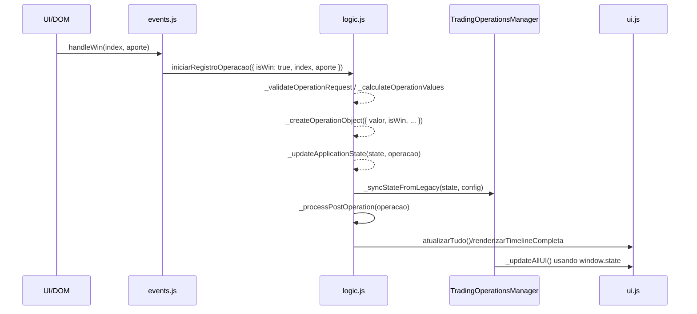

# Fluxo: Botão WIN

Objetivo: registrar vitória de uma etapa e atualizar todos os componentes
dependentes.

Pontos de entrada

- Clique no botão Win na linha do plano (ex.: `.win-btn-linha` →
  `events.handleWin(index, aporte)`)
- Ações programáticas: `logic.finalizarRegistroOperacao(tag)` após
  `iniciarRegistroOperacao`

Sequência de chamadas (alto nível)

Dados trafegados

- Entrada: `index:number`, `aporte:number` (parseado em `events.handleWin`)
- Operação criada:
  `{ id, isWin:true, entrada, valor, timestamp, etapa, payout }`
- Estado atualizado: `state.historicoCombinado.push(operacao)`,
  `state.capitalAtual`

Dependências

- `events.js`: `handleWin`, normalização de `aporte`
- `logic.js`: `_calculateOperationValues`, `_createOperationObject`,
  `_processPostOperation`
- `TradingOperationsManager.js`: `_syncStateFromLegacy`, `_updateAllUI`
- `ui.js`: `renderizarTimelineCompleta`, `atualizarDashboardSessao`,
  `renderizarTabela`

Falhas comuns e mitigação

- `aporte` como string → `events.handleWin` faz `parseFloat(aporte)||0`
- `valor` ausente → operação passa com `resultado`; UI usa fallback e
  investigador corrige
- UI não atualiza → garantir `ui.atualizarTudo()` e TM `_updateAllUI` usam
  `window.state`

Checklist

- Conferir logs de `logic._processPostOperation` e `TM._updateAllUI`
- `state.historicoCombinado.slice(-1)` contém operação com `valor` válido
- Timeline renderiza com
  `ui.renderizarTimelineCompleta(state.historicoCombinado)`
