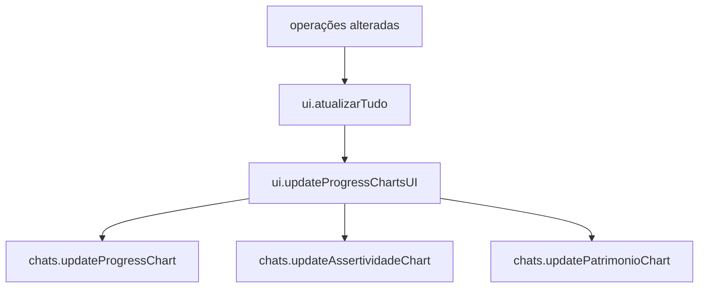

# Renderização de Gráficos

Objetivo: descrever pipeline de atualização dos gráficos (progresso,
assertividade, patrimônio) e dados de entrada.

Principais atores

- `charts.js`: `updateProgressChart`, `updateAssertividadeChart`,
  `updatePatrimonioChart`
- `ui.js`: `updateProgressChartsUI()`, `atualizarTudo()`
- `Logger/Performance`: markers e logs de performance

Fluxo (alto nível)

Entradas e cálculos

- Histórico: `state.historicoCombinado` (filtrado por dia/sessão)
- Estatísticas: win rate, loss rate, payoff, drawdown
- Gráficos usam arrays normalizados (labels, datasets) com validação

Pontos de atenção

- Evitar NaN: todos cálculos protegem `Number(...)` e `isNaN`
- Cache: `dashboardAggregateCache` pode fornecer séries prontas
- Performance: markers `charts_update_progress` e logs INFO/DEBUG já existentes

Checklist

- `charts.updateProgressChart(historico)` recebe `historico.length >= 0`
- Validação de dados antes do render
- Sem erros no console de Chart.js
